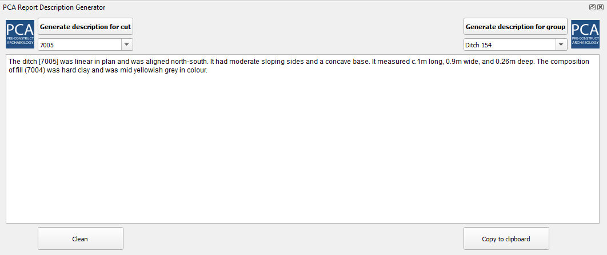

<h1>PCA Report Description Generator</h1>

PCA Report Description is an internal QGIS Plugin specifically built for the PCA post-excavation phase and can be considered as a component of the new DRS/GIS integrated data management system.

The plugin provides a dockable environment to help generate quick features description from DRS data that can be used on the report. 
The feature(s) that wants to be described can be recalled by choosing the value (context number or group name) from a dropdown list, or simply by selecting them in the map.

